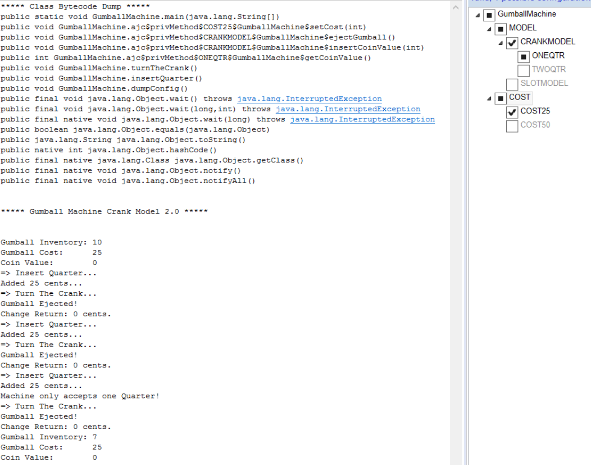
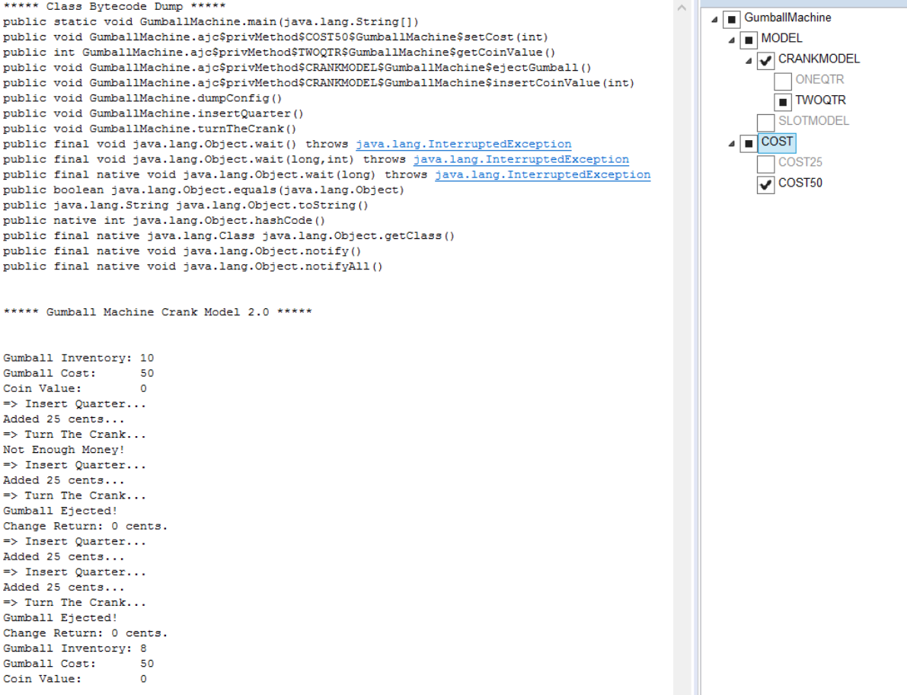
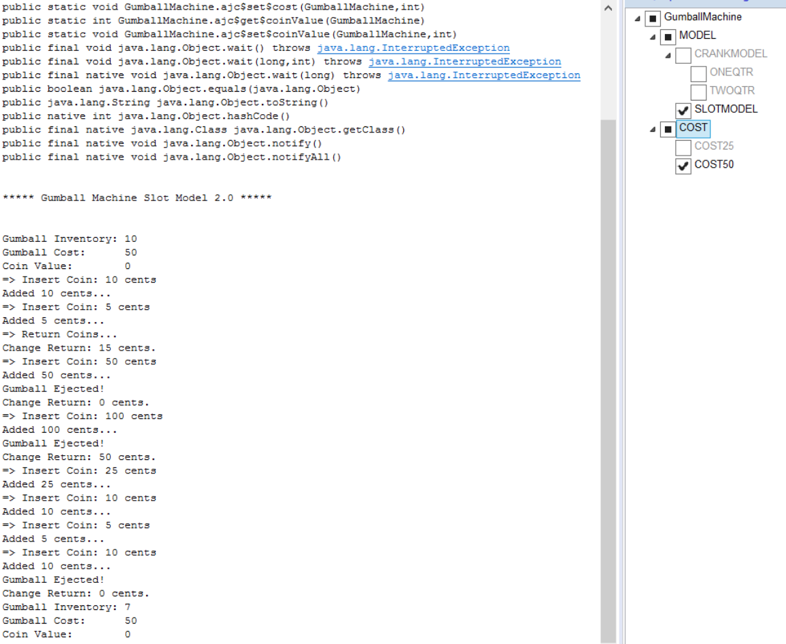
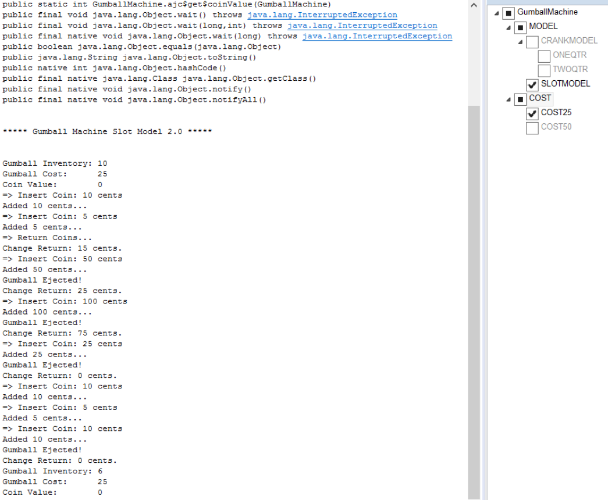

###  Screenshots-

- Configurations and outputs:

1.  COST: 25,Model: CRANK 

2. COST: 50,Model: CRANK 

3. COST: 50,Model: SLOT 

4. COST: 25,Model: SLOT 

###   Comparison

- In Lab 1,to support two additional types of gumball machines, we had to use class inheritance and create additional classes.To support more models we will have to keep on adding classes and to change any configuration like cost,model(slot/crank), existing code needs to be changed.
- Whereas in AspectJ programming,we are handling the configurations seperate from code.So inorder to change a configuartion we can change the config file and by using different feature combinations ,we can support a lot more models.

- AspectJ Programming is more flexible and simple.
