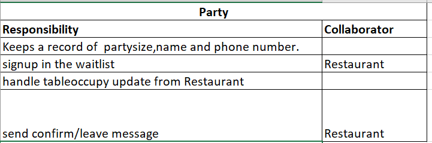
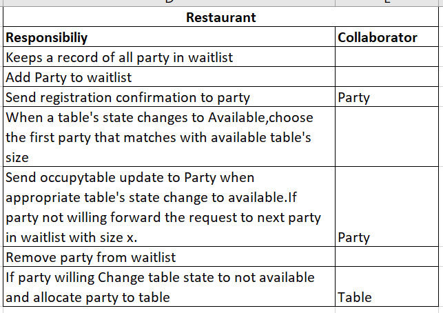
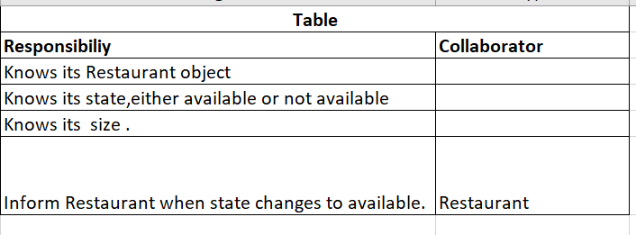

I am using two patterns in this program:Observer pattern and State pattern

1)Observer pattern between Restaurant(Subject) and Party(observer)

Since it is a one to many relationship between Restaurant object and Party objects and Party object needs to be notified of the events that they are subscribed to ,Observer pattern was used here.
Party,the observer here is subscribing to Restaurant for the event 'Table object corresponding to its  party size changes state to available'.When the Restaurant updates that  table object with appropriate size is available,Party can either choose to accept it or unsubscribe from the Restaurant.

2)State pattern for table

Since it is the table's  two states or status (available or not available ) that defines whether the Restaurant can seat a Party or not,I am using State pattern for Table object.
